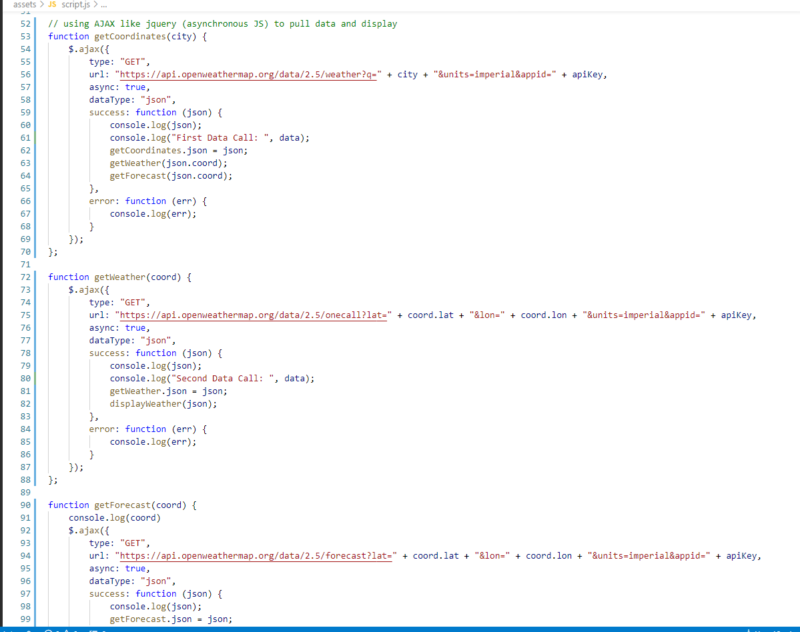

# WEATHER API:sunny:

## ❗Purpose❗
 * Create an app that allows a user to search for a certain city's current weather
 * User can see the city's curent and next five-day forecast
 * Past cities searched for will appear in a pop-up when typing
 * Weather details include temp, UV index, humidity, and wind speed

 *   ## Table of Contents:
1. [ GitHub ](#link-to-my-page)
2. [ Description ](#desc)
3. [ Built With ](#built-with)
4. [ Steps ](#steps)
5. [ Helpful Links ](#help)

 
 ## 1. Link To Project in My Github Pages:octocat:

## 2. Description✏️
This Weather Dashboard displays the current and future weather and conditions for a given city using two API calls. One is the geo call that gets latitude and longitude. The one call API fetches the weather conditions for a certain location, in this case calling for city and state.  

## 3. Built With🔨
 * CSS
 * HTML
 * JavaScript
 * Bulma
 * jQuery
 * Moment.js
 * OpenWeather API
  

 ## 4. Steps:ladder:
  To start, HTML is build with Bulma styuling to create box classes with widths to fit under the header title, WEATHER DASHBOARD.  
  
  

  Then, once all the boxes and columns line up next to eachother, the JavaScript is created with variables set.  
  

  The variables then can be used to call for coordinates with the GEO weather API (first link showed).  
  

  The second call from the One Call API then generates data like weather, UVI, wind speed, temperates, etc.  
  

  Once a city name is typed in the search bar, the city name, date, weather icon, and weather data pulled from the APIs  
   display in the box to the right of Search City. Below the searched city then shows the next five days of forecast  
   for that same city. If a city is spelled wrong, or nothing is typed, the user gets an error message.  
   The recent cities that have been searched for will list under the text box for 'Search' to show the last five cities and their weather data. 
 Using console.log in the Devtools was a major part in creating this app. It's a great way to check functionality of code and if data is even  
 coming through, instead of just coding blindly. 
 The UV index color coordinating comes from a scale that ranges 0-10 and in rare cases reaches over 11.  
  0-2 is low danger = green; 3-5 is moderate = yellow; 6-7 is high = orange; 8-10 is very high = red; higher than 10 is extreme = purple. 
  A simple app like this can be a big help for a traveler searching for their destined city to see how to pack and plan accordingly.

 
  ## 5. Helpful Links:link:

* [Favicons](https://www.w3schools.com/howto/howto_html_favicon.asp)
* [Weather API Icons](https://openweathermap.org/weather-conditions)
* [One Call API](https://openweathermap.org/api)
* [GeoCoding API](https://openweathermap.org/api/geocoding-api)
* [Using Fetch and .then to generate weather](https://www.visualcrossing.com/resources/documentation/weather-api/how-to-load-weather-data-in-javascript/)
* [AJAX](https://www.w3schools.com/whatis/whatis_ajax.asp)
